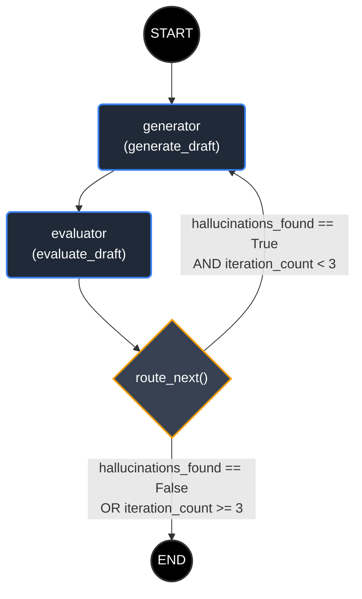

# 🛡️ Anti-Hallucination Resume Grounding Harness
An agentic pipeline that tailors your base resume to specific job descriptions, wrapped in a strict evaluation harness. This system catches and rejects LLM hallucinations, ensuring every claim in the generated resume is deterministically backed by your source-of-truth document.

Built using LangGraph (as the open-source Agent Development Kit) to handle the state-machine loop, and fast, open-weights models via Groq for cost-free, high-performance inference.

## 🏗️ Architecture Graph
The orchestration is structured as a cyclic state graph managed by LangGraph:



## ⚙️ Prerequisites
Python 3.10 or higher

A free API key from Groq Console

## 🚀 Local Setup & Installation

We use a `Makefile` to simplify the build environment configuration.

1. Clone the repository

```bash
git clone https://github.com/alwaysavani/grounding-eval-harness.git
cd grounding-eval-harness
```

2. Setup the environment (Installs dependencies in `.venv`)

```bash
make setup
```

Alternatively, you can do it manually:

```bash
python3 -m venv .venv
source .venv/bin/activate
pip install -r requirements.txt
```

## 🔑 Configuration & API Keys
This project uses python-dotenv to manage secrets securely.

1. Create your environment file

```bash
cp .env.example .env
```

2. Add your Groq API Key
Open the .env file and insert your key:

```env
# .env
GROQ_API_KEY=gsk_your_actual_api_key_here
```
Security Note: The .env file is explicitly ignored in .gitignore to prevent credential leaks. Never commit live keys.

## 📁 Project Structure
Place your unstructured, real-world source files directly into the data/ directory:

```text
resume-grounding-harness/
├── .env                    # Local secrets (Groq Key)
├── Makefile                # Build environment configuration
├── requirements.txt        # Python dependencies
├── src/
│   ├── app.py              # Main execution script running the LangGraph state machine
│   ├── tailor_agent.py     # Generator node logic
│   ├── grounding_harness.py# Evaluation node logic
│   └── schemas.py          # Pydantic models for structured analysis
└── data/
    ├── base_resume.md      # YOUR strict source-of-truth resume
    └── job_postings/
        └── job_1.txt       # Raw markdown/text copied from a live job board
```

## 💻 Quickstart & Execution

To run the pipeline and trigger the LangGraph orchestration loop with test data, simply use:

```bash
make test
```

If you want to manually test the app and pass specific arguments:

```bash
source .venv/bin/activate
python src/app.py --resume data/base_resume.md --job data/job_postings/job_1.txt
```

What happens under the hood:

Node 1 (Drafting): The generator reads your base resume and cross-references the job requirements to build a tailored version.

Node 2 (Auditing): The evaluator parses the draft, isolates explicit claims, and uses the local/Groq model to trace them back to the source.

The Loop: If a hallucinated metric or skill is identified, LangGraph automatically routes the state back to the generator with an error delta log, forcing a contextual rewrite.

## External Dependencies (requirements.txt)
Save the following block exactly as requirements.txt in your root directory:

```text
groq==0.5.0
langgraph==0.0.38
langchain-groq==0.1.3
python-dotenv==1.0.1
pydantic==2.7.1
rich==13.7.1
```